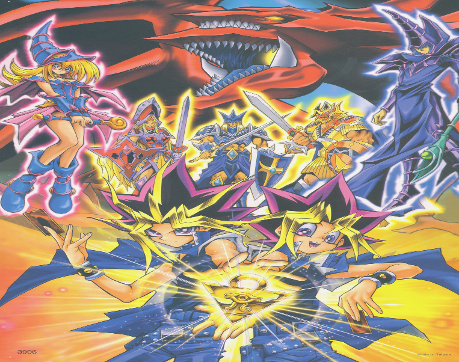
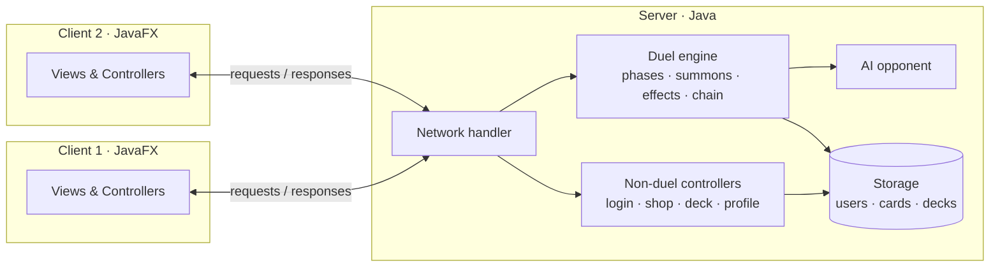
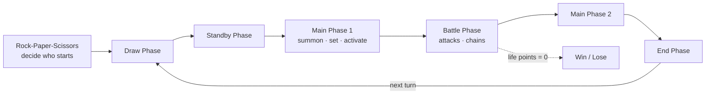

# 🃏 Yu-Gi-Oh! — JavaFX Trading Card Game



A full **Yu-Gi-Oh! dueling game** built in **Java + JavaFX**, featuring online player-vs-player matches, an interactive AI opponent, a complete duel engine, and a custom card creator.

> 🎥 **Video preview:** [watch the gameplay on Aparat](https://www.aparat.com/v/cABUj)

* **Course:** Advanced Programming — Spring 2021 · **Team-20**
* **Team:** Pooya Esmaeil Akhoondy · Mohammad Mowlavi Sorond · Mohammad Javad Maheronnaghsh

---

## 📋 Overview

This project re-implements most of the experience of a real Yu-Gi-Oh! game — from account login and deck building to full duels — on a **client–server architecture**. Two clients can connect to the same server and duel each other online, or a single player can take on the **AI**.

Two standout features:

1. **🎨 Card Creator** — design *any* card with *any* combination of effects. The more effects a card has, the higher its price. (See the *CardCreator* menu in-game.)
2. **🤖 Interactive AI gameplay** — beyond standard player-vs-player play, the AI mode adds richer, interactive dueling actions, including a cinematic **"Supreme King"** boss with 22 animated cutscenes.

---

## 🏗️ Architecture

The game runs as a **server** that holds all game logic and state, and one or more **clients** that render the JavaFX UI and send player actions.



---

## 🎮 Duel Flow

A duel follows the standard Yu-Gi-Oh! turn structure, with each phase driven by its own controller on the server:



Supported duel actions include **Normal / Tribute / Special / Flip summon**, **set monster & spell/trap**, **change position**, **monster-to-monster & direct attacks**, **spell/trap activation**, and full **chain** resolution — plus cheat codes for testing.

---

## ✨ Features

| Area | What it does |
|------|--------------|
| **Accounts** | Register, login, profile management |
| **Deck building** | Deck menu + deck editor (main / side deck), import & export decks |
| **Shop** | Buy cards, admin shop panel, and an **auction** page |
| **Card Creator** | Build fully custom cards; price scales with the chosen effects |
| **Online play** | Server–client networking for player-vs-player duels |
| **AI duel** | Interactive AI opponent with board understanding & phase "minds" |
| **Supreme King** | Cinematic AI boss with 22 cutscene videos |
| **Social** | Chat room, tweets, scoreboard |
| **Extras** | Rock-Paper-Scissors start, in-game music, animated transitions |

---

## 🧠 Under the Hood

- **Duel engine** — dedicated controllers per phase and per action (`GamePhaseControllers`, `ActionConductors`), card-effect handlers (`CardEffects`), and a `ChainController` for resolving effect chains.
- **AI** — a modular opponent (`AIBattlePhaseMind`, `AIMainPhaseMind`, `AIBoardUnderstander`, `AICardFinder`, `AIQueryUnderstander`) that reads the board and plans actions per phase.
- **Card model** — separated data for Monster / Spell / Trap cards with typed effect enums.
- **Persistence** — user, card, and deck data stored on the server (JSON via Gson, CSV via OpenCSV).

---

## 🗂️ Repository Structure

```
Yu-Gi-Oh/
├── src/main/java/project/
│   ├── client/            # JavaFX views & controllers (MainView is the entry point)
│   │   └── view/          # Login, MainMenu, Shop, DeckMenu, CardCreator, ChatRoom, ...
│   ├── server/            # Main server + game logic
│   │   └── controller/
│   │       ├── duel/      # duel engine: phases, summons, effects, chain, AI, cheats
│   │       └── non_duel/  # login, shop, deck, profile, scoreboard, tweets, storage
│   └── model/             # card data, effect enums, utilities
├── src/main/resources/    # FXML, CSS, images, icons, audio & Supreme King videos
├── Resourses/Server/      # server-side data
├── pom.xml                # Maven build (JavaFX 16, Gson, OpenCSV, JUnit)
└── README.md
```

---

## 🚀 Running the Game

This is a **server–client** application, so start the server first, then one or more clients.

```bash
# 1) Start the server
#    src/main/java/project/server/Main.java

# 2) Start a client (the JavaFX app)
#    src/main/java/project/client/view/MainView.java
```

Run `MainView` again in a second instance to log in as another client and have the two play against each other — or duel the **AI**.

> The project uses **Maven** with the JavaFX Maven plugin. Open it in an IDE (IntelliJ — `.idea` config is included) and run the two entry points above, or use the JavaFX plugin to launch.

---

## 🛠️ Tech Stack

- **Language:** Java
- **UI:** JavaFX 16 (FXML + CSS), with media, animations & transitions
- **Networking:** server–client architecture (sockets)
- **Data:** Gson (JSON), OpenCSV (CSV)
- **Build & test:** Maven, JUnit 5
